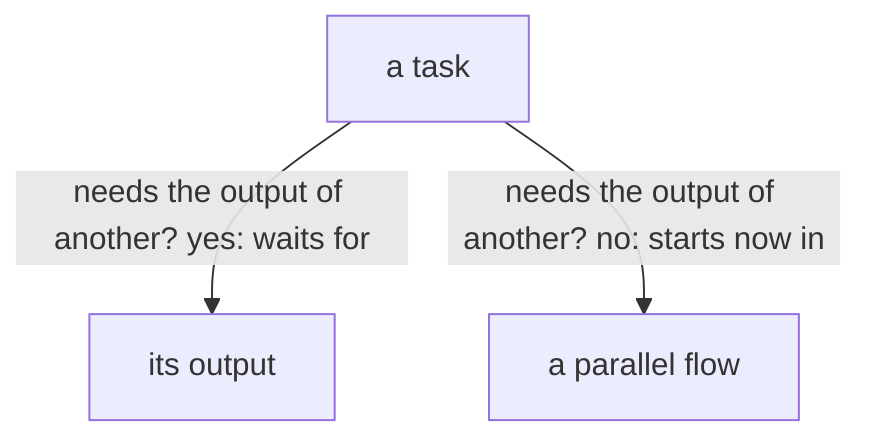

A flow waits for one thing, the output its task needs next, and does everything else meanwhile.

```mermaid
flowchart TB
    a["a task"] -- "needs the output of another? yes: waits for" --> b["its output"]
    a -- "needs the output of another? no: starts now in" --> c["a parallel flow"]
```

Each task runs on its own need.
